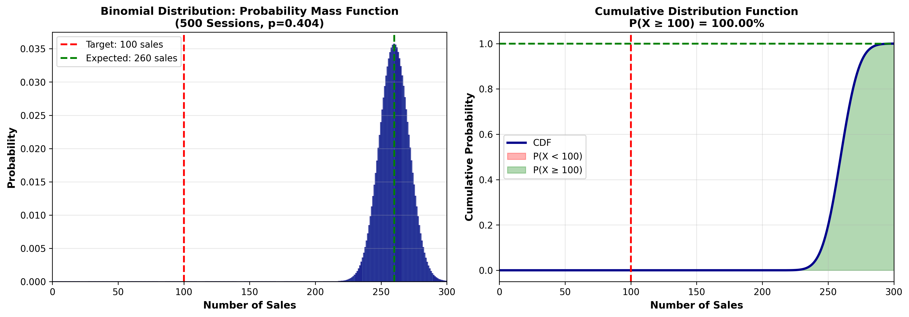

# Peak Season Campaign Success Probability Forecasting

Statistical analysis of online shopping behavior to forecast the success of a
customer-retention marketing campaign, using segmentation, correlation
analysis, and binomial probability modeling in Python.


---

## Overview

An e-commerce startup's marketing team wanted to understand customer browsing
behavior during its busiest months — November and December — in order to
plan a returning-customer marketing campaign for the following year.

This project answers three business questions using session-level shopping
data:

1. **Do returning customers or new customers convert better in peak season?**
2. **Which browsing behaviors are most closely related to each other?**
3. **If we boost the returning-customer purchase rate by 15% and run the
   campaign across 500 sessions, how likely are we to hit 100 sales?**

The analysis combines descriptive statistics, Pearson correlation, and
binomial probability modeling — then translates the statistical output into
concrete operational guidance (inventory levels, staffing, and expected
revenue).

---

## Key Results

| Question | Method | Result |
|---|---|---|
| Purchase rate by customer type (Nov–Dec) | Groupby + rate calculation | **New: 27.3%** vs. **Returning: 19.6%** |
| Strongest engagement correlation | Pearson correlation (`pandas.corr`) | `Administrative_Duration` ↔ `ProductRelated_Duration`, **r = 0.390** |
| P(≥100 sales \| 500 sessions, +15% rate boost) | Binomial CDF (`scipy.stats.binom`) | **90.12%**, expected **~112 sales** |

**Headline finding:** new customers convert at nearly 1.4x the rate of
returning customers during peak season — the opposite of what a
loyalty-driven assumption would predict — which reframes where the
marketing budget should go.



*Probability distribution of sales outcomes for 500 sessions at the
boosted purchase rate. The 100-sale target sits well below the distribution's
center, consistent with a 90.12% probability of success.*

---

## Repository Structure

```
online-shopping-campaign-forecasting/
├── README.md                  ← you are here
├── LICENSE
├── requirements.txt
├── src/
│   └── campaign_analysis.py   ← full, reproducible analysis script
├── docs/
│   └── METHODOLOGY.md         ← statistical methodology & formulas
├── images/
│   └── campaign_binomial_distribution.png
└── data/
    └── README.md              ← data schema (data not included — see below)
```

---

## How to Run

```bash
git clone https://github.com/<your-username>/online-shopping-campaign-forecasting.git
cd online-shopping-campaign-forecasting
pip install -r requirements.txt
```

Place `online_shopping_session_data.csv` in the `data/` folder (see
[`data/README.md`](data/README.md) for the expected schema), then:

```bash
python src/campaign_analysis.py
```

This prints all three results to the console and saves
`campaign_binomial_distribution.png` to the `images/` folder.

---

## Methodology Summary

- **Segmentation:** filtered sessions to November and December, then grouped
  by `CustomerType` to compute purchase rate as purchases ÷ total sessions.
- **Correlation:** computed pairwise Pearson correlations across the three
  duration metrics (`Administrative_Duration`, `Informational_Duration`,
  `ProductRelated_Duration`) and selected the strongest pair.
- **Probability modeling:** modeled each session as an independent Bernoulli
  trial and used the binomial distribution (`n=500`, boosted `p`) to
  calculate `P(X ≥ 100)` via `1 - scipy.stats.binom.cdf(99, n, p)`.
- **Confidence interval:** derived the expected value (`n·p`) and standard
  deviation (`√(n·p·(1-p))`) to build a 95% confidence range for inventory
  and staffing planning.

Full formulas and a step-by-step derivation are in
[`docs/METHODOLOGY.md`](docs/METHODOLOGY.md).

---

## Tech Stack

- **Python 3.9+**
- **pandas** — data loading, filtering, groupby aggregation
- **NumPy** — numerical computation (mean, standard deviation)
- **SciPy (`scipy.stats`)** — binomial distribution, CDF, PPF
- **Matplotlib** — probability distribution visualization

---

## Business Recommendations

1. Investigate why new customers convert ~39% higher than returning
   customers in peak season — this may justify reallocating budget toward
   acquisition rather than retention.
2. Proceed with the returning-customer campaign: a 90.12% success
   probability is strong statistical support for launch.
3. Plan inventory and fulfillment capacity around the expected ~112 sales,
   not just the 100-sale minimum target.
4. Use the correlation between administrative and product-page engagement
   to inform site navigation and cross-page recommendations.

---

## Data

This repository does not include the underlying session data. See
[`data/README.md`](data/README.md) for the column schema so the script can
be run against an equivalent dataset.

---

## License

This project is licensed under the MIT License — see [LICENSE](LICENSE).
